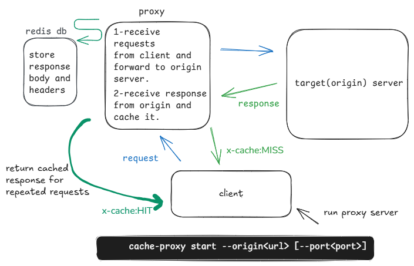
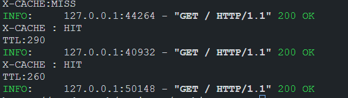

# cache-proxy — Async caching reverse proxy

cache-proxy is a http proxy built with python and fastapi.

- forward client requests to target server.
- receive responses from origin server and cache them.
- return cached data to client for repetitive requests.
## Features
- redis_based cache
- asynchronous request forwarding(fastapi+httpx)
- headers management
- command line interface
## Limitations
Note that this is a basic proxy for learning purposes and not fully compatible with RFC rules.so it may have unexpected behavior in some cases.
## Installation
      pip install git+https://github.com/mohsen481/cache-proxy.git
## Usage
```
start proxy:
cache-proxy start --origin https://dummyjson.com 

clear cache:
cache-proxy clear-cache

help:
cache-proxy --help

```
#### sample output:

### Tools:
   -  python
   -  fastapi
   -  redis
   -  typer
   - httpx

### Inspiration
<https://roadmap.sh/projects/caching-server>